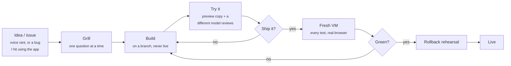

<div align="center">

<a href="https://pmserver.us"></a>


<sub>Live from my server's own records. 22 billion tokens since March (as of Sep 30, 2026), mostly agents re-reading code.</sub>

</div>

---

I'm self-taught, in Sioux Falls, SD. In February I asked Grok how to set up a server and typed every command it gave me by hand. Now one mini PC at home runs 20+ services, my own CI, a nightly security audit, and a crew of AI agents I direct from my desk and my phone.

I don't write most of my code. The part I'm learning to own is what each app must always get right, written down in my own words, one app at a time.

## The loop



When an agent screws up, I ask what threw it off: my context, missing context, the model, or the framework. The fix goes into one shared context repo that every machine pulls every few minutes, so Claude, Codex, Grok and OpenCode all follow it from then on.

## The crew

| Agent | Job |
|---|---|
| Claude Opus | Main builder |
| Claude Fable | Second opinion, reviews other models' work |
| Codex | Builder and deep reviewer |
| Grok | Outside voice on reviews |
| astra | "it usually comes up with really good ideas for projects/features/tools, but it sucks at implementation" |
| Local model | Small private jobs on my desktop |

## What came out of it

<table>
<tr>
<td width="50%" valign="top">
<br>
<b>Finance</b> · <i>in daily use</i><br>
My money dashboard, fed by my bank.
</td>
<td width="50%" valign="top">
<br>
<b>Server dashboard</b> · <i>in daily use</i><br>
The cockpit for my server, and the app behind <a href="https://pmserver.us">pmserver.us</a>.
</td>
</tr>
<tr>
<td valign="top">
<br>
<b>FirePOS</b> · <i>built for a real business</i><br>
Point of sale and stock for fireworks tents. 148 commits in its first 3 days.
</td>
<td valign="top">
<br>
<b>Journey</b> · <i>built for a real business</i><br>
Booking for a family camper rental business.
</td>
</tr>
<tr>
<td valign="top">
<a href="https://pmserver.us/rocket-league"></a><br>
<b>Rocket League maps</b> · <i>for fun</i><br>
An agent builds them by driving the level editor. This is Andy's Room, a ring run through a Toy Story bedroom. The first maps worked and were bad. <a href="https://pmserver.us/rocket-league">How they got good.</a>
</td>
<td valign="top">
<br>
<b>The server</b> · <i>runs all of it</i><br>
Password manager, file sync, photos, a Discord-like chat the server talks to me in, uptime checks, and Minecraft for friends.
</td>
</tr>
</table>

Also: **Tokdash** (my AI usage meter, a fork of Jingbiao Mei's), my **Omarchy** desktop setup, a crypto **trader bot** that paper-trades to find out if a strategy really works, and an ESP32 alarm that only stops after I finish a short coding session.

## How I know it works

- **I built my own CI.** Every change runs every test in a throwaway VM with no passwords or real data. The CI does the merging, so nothing red lands.
- **Rollbacks get rehearsed.** Start the old version, upgrade, undo. The data has to come back byte for byte.
- **The server audits itself every night.** 31 areas, from container CVEs to leaked keys to whether backups restore. An AI explains each finding in plain English, and anything high pings my phone. Every Sunday the scanner tests itself, so a scan that didn't run never shows as all clear.
- **Fresh eyes.** A second AI with none of the first one's context reviews diffs for security holes. Anything touching money gets its own review.

What this doesn't prove: some of the UI is rough, and none of it is finished. What software is?

## Public repos

| Repo | What |
|---|---|
| [ground-up](https://github.com/not-compromised/ground-up) | A learning system you run with your coding agents, so AI-built repos stay yours to read |
| [skills-mcp](https://github.com/not-compromised/skills-mcp) | Some of my agent skills and MCP servers |

## How it got here

```
Feb   v1  Grok in a chat window. I typed every command.
Feb   v2  Claude Code. The agent types, I say what I want.
Feb   v3  A team of bots on chat. Nobody read their reports, me included.
Jun   v4  Back after a month off, going ham. 296 commits in June, 1019 in July.
Jul   v5  T3 Code: many threads, any machine, one shared context.
Aug   v6  Omarchy: the desktop became something I just ask for.
Sep   v7  Voice. An idea comes out as a rant, and the rant is the prompt.
```

<div align="center">
<sub>Security habits from a year of Cyber Operations at Dakota State University. Full story at <a href="https://pmserver.us/evolution">pmserver.us/evolution</a>.</sub>
</div>
